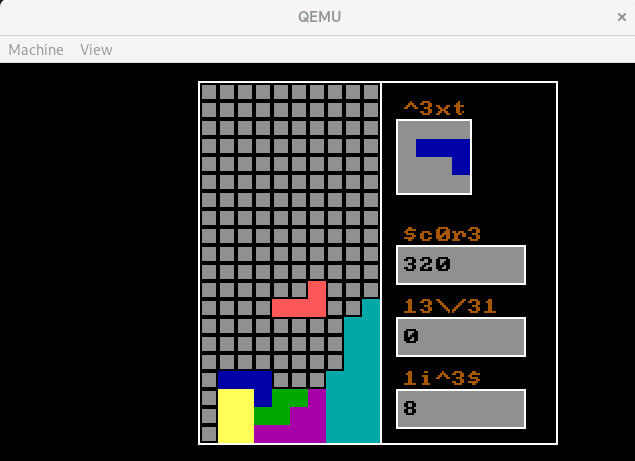

# Bare metal tetris: Tetris without OS

To compile and run:
```bash
make
make run
```
Commands:

* Left:      `left arrow`
* Right:     `right arrow`
* Rotate:    `up arrow`
* Accelerate fall: `down arrow`
* Drop:     `space bar`
* Pause:    `p`
* New game: `n`
* Sound on/off: `o` (beware the sound is loud)




To compile and debug:

```bash
make
make debug
```

and 

```bash
gdb
(gdb) file bin/kernel.sym
(gdb) target remote localhost:1234
(gdb) c
```
